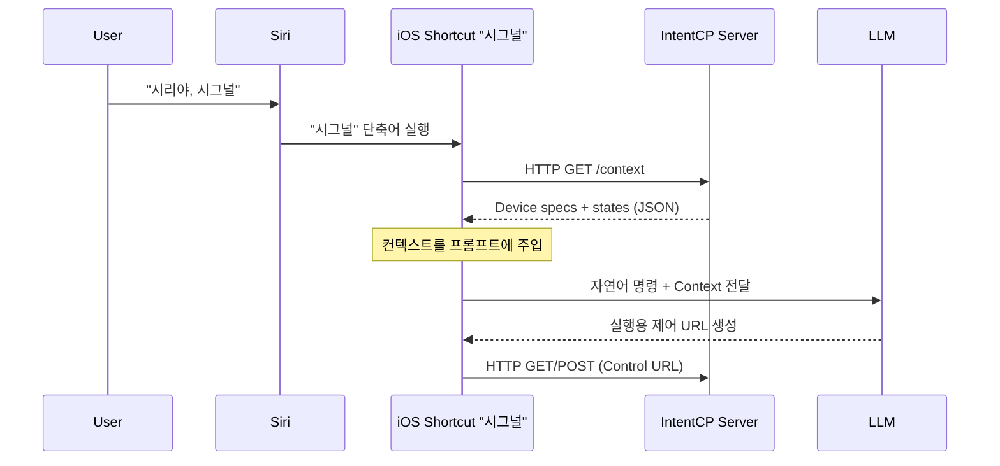

# IntentCP

> **iOS Shortcuts 기반 자연어 제어를 위한 경량 Control Plane**  
> 별도의 로컬 LLM이나 GPU 서버 없이, 휴대폰에서 해석한 의도를  
> **안전한 실행 포맷(Control URL)** 으로 변환해 실제 액션으로 연결합니다.

[](https://opensource.org/licenses/MIT)
[](https://www.python.org/downloads/)
[](https://support.apple.com/ko-kr/guide/shortcuts/welcome/ios)

> **Note (이름 혼선 방지)**
> 
> IntentCP는 Anthropic의 **Model Context Protocol (MCP)** 구현과 무관합니다.
> 이 프로젝트에서 말하는 Control Plane은 **자연어 의도 → 실행 요청(Control URL) → 로컬 실행**을 연결하는 아키텍처를 뜻합니다.

IntentCP는 **자연어 명령을 곧바로 실행하지 않습니다.**  
대신 자연어를 **표준화된 실행 요청(Control URL)** 으로 변환하고,  
서버는 정의된 규칙 안에서만 이를 실행하는 구조를 채택합니다.

현재는 **iOS Shortcuts-first** 접근을 통해  
Siri와 휴대폰의 AI(Apple Intelligence / 선택적 ChatGPT)를  
자연어 해석 레이어로 활용합니다.  
실행 레이어는 스마트홈(IoT)뿐 아니라 **Windows Agent 등 로컬 시스템 제어**까지 확장 가능하도록 설계되어 있습니다.

**TL;DR**
- 📱 **Shortcuts-first UX**: “시리야, 시그널”로 바로 실행
- 🤖 **No local AI hosting**: 집에 GPU/로컬 LLM 서버 불필요
- 🔗 **URL 기반 실행 모델**: 자연어 → Control URL → 서버 실행
- 🧩 **멀티 타깃 제어**: Tuya + Windows Agent 등 실행 대상 확장 전제

## ✨ 왜 IntentCP인가요?

- **예측 가능한 실행**: 자연어는 **Control URL**로 정규화되고, 실행은 서버가 정의된 스펙/제약 안에서만 수행합니다.
- **No local AI hosting**: 집에 GPU/LLM 서버를 두지 않고, 휴대폰(온디바이스/클라우드)의 AI를 활용합니다.
- **Control URL(표준 실행면)**: 모든 동작은 URL 스펙으로 표현되어 음성/스크립트/자동화가 동일 포맷을 공유합니다.
- **멀티 타깃 확장**: Tuya → (로컬) Windows Agent → Matter/Zigbee 등, 실행 대상을 플러그인처럼 늘릴 수 있는 구조를 지향합니다.

## 🚀 The Vision: Intent Control Plane

IntentCP는 “자연어로 말하면 알아서 해주는” 데모가 아니라,
**의도 해석(LLM) ↔ 실행(Control Plane) ↔ 피드백(LLM/TTS)** 을 분리해 조합 가능한 형태로 만드는 것을 목표로 합니다.

---

## Demo
> (추가 예정)

- 예시 호출
  ```bash
  # 조명 ON
  curl -X POST "http://localhost:8000/tuya/living_light/on"

  # 상태 조회
  curl -X GET "http://localhost:8000/tuya/living_light/status"

  # 시퀀스
  curl -X GET "http://localhost:8000/tuya/sequence?actions=living_light:on,subdesk_light:off%3Fdelay%3D5"
  ```

## Key Features

- 📱 **iOS Shortcuts 중심 UX**: “앱 설치/대시보드”보다 **단축어 실행**을 배포·사용 단위로 설계
- 🤖 **AI 운영 불필요 (No AI Hosting Required)**
  - 로컬 LLM, 별도 모델 서버, GPU/VRAM 없이 사용
  - **단축어의 Apple AI(비공개 클라우드)** + **ChatGPT(계정 보유 시 선택)** 조합 지원
- 🧠 **2단계 LLM 파이프라인(제품 기능)**
  - LLM #1: 자연어 명령 → **실행 URL 생성**(안전한 실행 포맷)
  - LLM #2: 제어 결과 JSON → **한 줄 피드백 생성**(실패 이유/상태 포함)
- 🔗 **URL 기반 제어 스펙**(GET/POST 공용): 음성/버튼/스크립트/스케줄러가 동일 실행 포맷 공유
- ☁️ **Tuya Cloud 실 디바이스 제어 연동** (on/off, brightness, status, scene, sequence)
- 🧩 **확장 가능한 Action 매핑 구조**: Tuya 외(Windows Agent 등) 제어 대상 확장 전제
- 🖥️ 기본 **Web Panel** 제공(디바이스/설정 확인 및 테스트)
- 🧰 **Monorepo 구성**: core 서버 / Shortcuts 배포 / (WIP) 프롬프트·스키마 오케스트레이션
- 🗺️ 통합 GUI 기반 디바이스·Scene·계정 관리 (계획)

---

## System Overview

AI Assistant(Siri) → iOS Shortcuts → LLM #1 → IntentCP 서버 → (Tuya Cloud | Windows Agent) → 실제 디바이스  
실제 디바이스 → (Tuya Cloud | Windows Agent) → IntentCP 서버 → LLM #2 → iOS Shortcuts → AI Assistant(Siri)

## Design Notes

IntentCP는 “스마트홈을 붙여 쓰는” 프로젝트가 아니라, **의도 해석(LLM) ↔ 실행(IntentCP) ↔ 피드백(LLM/TTS)** 을 분리해 조합 가능한 형태로 만드는 것을 목표로 합니다.

- **AI 운영 부담 제거**: 단축어에서 제공되는 Apple AI/ChatGPT를 활용해 *모델/서버 운영 없이* 음성 제어 경험 제공
- **벤더 종속 최소화**: 음성 플랫폼에 붙는 로직은 Shortcuts에, 실행 로직은 서버에 분리
- **자동화 친화적**: URL 스펙 하나로 음성/버튼/스크립트/스케줄러가 동일하게 동작
- **확장 가능**: Tuya-first지만, 이후 Matter/Zigbee/로컬 에이전트로 확장 가능한 구조

---

## Repository Structure

본 프로젝트는 단일 Monorepo 구조로 구성되며, 각 서브 디렉터리는 IntentCP 시스템의 개별 구성 요소를 담당합니다.

```bash
IntentCP/
  README.md                         # Project overview (EN)
  README.ko.md                      # Project overview (KO)

  intentcp-core/                    # Core server (FastAPI)
    src/                            # Server implementation
    cli/                            # CLI for setup / operations
    pyproject.toml
    web/                            # Web panel (templates/static)

  intentcp-shortcuts-signal/   # Siri Shortcut (Signal) distribution & docs
    README.md
    README.ko.md
    install/                        # iCloud link + setup checklist (KO/EN)
    prompts/                        # Canonical prompts (LLM #1 / #2)
    shortcuts/                      # Signal.shortcut + example
    scripts/                        # Export / validation helpers

  intentcp-llm-flows/               # Prompt orchestration (planned / WIP)
    # Schemas, generators, CLI/GUI (future)
```

---

## What is IntentCP?

IntentCP는 현재 **iOS Shortcuts-first**로 “AI 운영 없이” 음성 기반 제어 경험을 제공하지만,
장기적으로는 사용자 설정을 중심으로 **계정/디바이스/씬/프롬프트/단축어 배포**까지 자동으로 이어지는
**통합 Control Plane**을 목표로 합니다.

아래는 IntentCP가 지향하는 “궁극적인 통합 시나리오”입니다.

- 사용자는 단일 GUI 또는 CLI 환경에서
  - Tuya 계정 인증
  - 디바이스 자동 스캔 및 등록
  - 디바이스 별 호출 이름(alias) 지정
  - Scene(시나리오) 생성 및 관리
- 위 설정을 기반으로
  - `intentcp-core` 서버 설정 파일 자동 생성
  - `intentcp-llm-flows`에서 LLM 프롬프트 자동 생성
  - `intentcp-shortcuts-signal`에서 해당 프롬프트를 사용하는 단축어 링크 자동 생성

즉, IntentCP는 **사용자 설정 → 서버 설정 → LLM 프롬프트 → 음성 단축어까지를 하나의 파이프라인으로 자동 구성하는 통합 오케스트레이션 시스템**을 지향합니다.

---

## End-to-End Control Flow


### (로드맵) `/context` 기반 동적 컨텍스트 주입 플로우



---

## Component Roles

| 구성 요소 | 역할 |
|-----------|------|
| User | 음성 명령 입력 |
| AI Assistant (Siri) | 음성 명령 트리거 |
| iOS Shortcuts | 음성 변환, LLM 호출, HTTP 요청, 음성 출력 |
| LLM #1 | 자연어 명령 → 제어 URL 생성 |
| IntentCP 서버 | 개인 실행(Control Plane) 서버, Tuya API 중계 |
| Tuya Cloud | 실제 IoT 디바이스 제어 |
| LLM #2 | JSON → 자연어 응답 생성 |

---

## Supported Capabilities

- 디바이스 ON / OFF  
- 조명 밝기(brightness) 조절  
- 디바이스 상태 조회  
- 프리셋(Scene) 실행  
  - 무드 조명 모드  
  - 영화 감상 모드  
  - 취침 모드  
- Windows PC 제어 (화면 제어, 앱 실행 등 – Agent 기반)

<details>
<summary><b>Control URL Specification (API)</b> — 자세한 스펙은 접어두었습니다</summary>

---

## Control URL Specification (IntentCP v1)

IntentCP는 **URL 기반 제어 규칙**을 중심으로 음성 명령, LLM, 자동화를 연결합니다.
모든 제어는 HTTP **GET / POST** 요청으로 실행할 수 있으며,
이 URL 체계는 LLM #1이 자연어 명령을 실제 제어 요청으로 변환하는 기준 스펙으로 사용됩니다.

---

### 1) Single Action (단일 동작)

```
/tuya/{device}/{action}
```

Optional delay:

```
/tuya/{device}/{action}?delay={seconds}
```

Examples:
- 거실 불 켜기  
  `/tuya/living_light/on`
- 책상 불 10초 뒤 끄기  
  `/tuya/subdesk_light/off?delay=10`
- 디바이스 상태 조회  
  `/tuya/living_light/status`

---

### 2) Sequence (복수 동작 / 시퀀스)

여러 개의 동작을 하나의 요청으로 실행할 수 있습니다.

```
/tuya/sequence?actions=step1,step2,...
```

각 step 형식:

```
{device}:{action}[?delay=seconds]
```

- `delay`는 선택 사항이며, **현재 시점 기준 지연 실행**을 의미합니다.
- delay가 없는 step은 즉시 실행됩니다.
- step은 **URL에 작성된 순서를 그대로 유지하여 실행**됩니다.

Examples:

- 문 열고 거실 불 켜기
```
/tuya/sequence?actions=door:open,living_light:on
```

- 불을 켰다가 2시간 뒤 끄고, 컴퓨터는 1시간 뒤 끄기
```
/tuya/sequence?actions=living_light:on,living_light:off?delay=7200,pc:off?delay=3600
```

이 URL 구조는 음성 명령, 자동화 루틴, LLM 기반 해석 결과를
**하나의 공통 실행 포맷**으로 통합하기 위한 IntentCP의 핵심 설계입니다.

---

</details>

---

## Planned Extensions

- 일정 · 날씨 · 위치 · 센서 조건 기반 자동화
- **(로드맵) 동적 컨텍스트 주입(`/context`)**
  - Shortcuts가 실행 시점에 IntentCP 서버에서 **디바이스 스펙/상태 컨텍스트**를 받아 프롬프트에 주입
  - 목적: 존재하지 않는 기기/지원하지 않는 파라미터 생성 가능성을 낮추고, 자연어 → Control URL 변환 품질을 안정화
- **멀티 IoT 플랫폼 지원**
  - Tuya 외 Cloud API 제공 IoT 플랫폼 연동
  - 벤더 종속성을 제거한 공통 Action 레이어
- **로컬 통신 기반 디바이스 제어** (Zigbee / Matter 등)
- Windows / macOS 에이전트 기반 로컬 시스템 제어
- 카메라 및 각종 센서 연동
- HomeKit 포함 다중 플랫폼 하이브리드 제어
- 모바일 웹 대시보드 및 통합 Web GUI
- Google Assistant 등 타 음성 플랫폼 확장
- (추후) **표준 MCP 프로토콜 인터페이스** 제공 옵션 (외부 Tool Host 연동)

---

## System Automation Vision

IntentCP는 단순한 서버 + 단축어 조합이 아니라,  
**사용자 설정을 중심으로 모든 구성 요소가 자동으로 생성·연동되는 시스템**을 목표로 합니다.

최종 목표 흐름은 다음과 같습니다.

1. 사용자가 IntentCP GUI 또는 CLI에서 Tuya 계정을 연동
2. 디바이스 자동 스캔 및 등록
3. 각 디바이스 별 호출 이름(alias) 지정
4. 사용자 정의 Scene 생성
5. 위 설정을 기반으로
   - IntentCP Core 설정 파일 자동 생성
   - LLM Control / Response 프롬프트 자동 생성
   - Siri Shortcut 링크 자동 생성

결과적으로 사용자는 **별도의 복잡한 설정 없이 음성 기반 스마트홈 제어 환경을 구성할 수 있는 구조**를 지향합니다.

---

## Project Objectives

본 프로젝트는 단순한 스마트홈 자동화 구현이 아니라,

- 음성 기반 AI 어시스턴트 중심의 IoT 제어 인프라 구조 설계
- 개인 서버 기반 **Home Control Plane** 구축 (실행 레이어/피드백 레이어 분리)
- LLM 기반 자연어 제어 및 응답 파이프라인 검증
- 특정 벤더에 종속되지 않는 확장형 음성 인터페이스 구조 실험

---

## Quick Start (초기 사용 방법)

> 아래 가이드는 **개발/테스트용 최소 셋업** 기준입니다. (배포/운영은 `Planned Extensions`의 Web GUI, 인증, 네트워크 보안 항목과 함께 별도 정리 예정)

### 0) 권장 환경

- **Python 3.11+ 권장** (현재 개발/테스트 기준)
  - macOS에서는 `pyenv` 사용을 권장합니다.
- macOS / Linux 권장

### 1) 레포 클론

```bash
git clone https://github.com/jaebinsim/IntentCP
cd IntentCP
```

### 2) Python 설치/고정 (macOS + pyenv, 선택)

```bash
brew update
brew install pyenv

pyenv install 3.12.2
pyenv local 3.12.2
```

> 이미 Python 3.11+가 준비되어 있다면 이 단계는 생략해도 됩니다.

### 3) 가상환경 만들기

```bash
python3 -m venv .venv
source .venv/bin/activate

python -m pip install --upgrade pip
```

### 4) Core 서버 설치 (`intentcp-core`)

IntentCP는 Monorepo 구조이지만,  
**현재 Python 의존성은 `intentcp-core/pyproject.toml`에서 단일 관리**됩니다.

초기 실행을 위해서는 `intentcp-core`만 설치하면 됩니다.

```bash
python -m pip install -e ./intentcp-core
```

### 5) 설정은 Wizard로 끝 (TOML 직접 편집 불필요)

이제부터는 설정 파일을 직접 복사/편집할 필요가 없습니다.
`intentcp init`이 **Wizard 방식으로** 필요한 설정(계정/리전/디바이스 등)을 안내하고,
완료 후 설정 파일을 자동으로 생성합니다.

```bash
intentcp --help
intentcp init
```

- 생성되는 설정 파일 위치:
  - `intentcp-core/config/settings.toml`
  - `intentcp-core/config/devices.toml`

### 6) 서버 실행 (Core: intentcp-core)

```bash
uvicorn intentcp_core.app:app --reload --host 0.0.0.0 --port 8000
```

- Web Panel
  - 로컬: `http://127.0.0.1:8000/panel/`
  - 같은 Wi‑Fi/LAN: `http://<your-local-ip>:8000/panel/`

### 7) 디바이스 확인/관리 CLI

```bash
intentcp devices --help
```

### 8) 기본 제어 테스트 (선택)

```bash
# 단일 동작: 조명 ON
curl -X POST "http://localhost:8000/tuya/living_light/on"

# 단일 동작: 조명 OFF
curl -X POST "http://localhost:8000/tuya/living_light/off"

# 상태 조회
curl -X GET "http://localhost:8000/tuya/living_light/status"

# 시퀀스: 거실 불 켜고 5초 뒤 책상 불 끄기
curl -X GET "http://localhost:8000/tuya/sequence?actions=living_light:on,subdesk_light:off?delay=5"
```

### 9) Siri Shortcuts 연결 (Signal: intentcp-shortcuts-signal)

1) `intentcp-shortcuts-signal/install/setup-checklist.ko.md`를 따라 단축어를 설치
2) 단축어 내부의 IntentCP 서버 주소를 내 서버 주소로 변경
3) 음성으로 호출

- “시리야, 시그널” → 받아쓰기 → “거실 불 켜줘”

> ⚠️ 현재 LLM 프롬프트/플로우 자동 생성 기능은 구조 설계 단계이며,
> 초기 버전에서는 개념 설명 위주로 제공됩니다. (CLI/GUI 기반 자동화는 추후 제공 예정)

### 10) LLM 프롬프트/플로우 설정 (intentcp-llm-flows)

`intentcp-llm-flows`는
- LLM #1: 자연어 → 실행 URL 생성
- LLM #2: JSON 결과 → 자연어 응답

을 위한 프롬프트/스키마를 관리합니다.

---

## Troubleshooting

- **Tuya 제어가 안 먹는 경우**
  - endpoint(리전) 확인, device_id 확인, 디바이스 capability 확인(밝기 지원 여부 등)
- **서버는 뜨는데 단축어에서 실패하는 경우**
  - iOS에서 로컬 네트워크 접근 권한/방화벽/포트포워딩/SSL 확인

---

## 📱 Siri Shortcuts (Signal) 문서 바로가기

IntentCP의 음성 제어 진입점인 **Siri Shortcuts (Signal)** 과 관련된 문서들입니다.  
실제 음성 제어를 사용하려면 아래 문서들을 순서대로 참고하는 것을 권장합니다.

- 📄 **Signal 단축어 프로젝트 개요**
  - [intentcp-shortcuts-signal/README.ko.md](intentcp-shortcuts-signal/README.ko.md)

- 🔗 **iCloud 단축어 설치 링크**
  - [intentcp-shortcuts-signal/install/iCloud-link.ko.md](intentcp-shortcuts-signal/install/iCloud-link.ko.md)

- ✅ **단축어 설정 체크리스트 (필수)**
  - [intentcp-shortcuts-signal/install/setup-checklist.ko.md](intentcp-shortcuts-signal/install/setup-checklist.ko.md)

- 🧠 **LLM 프롬프트 가이드**
  - [intentcp-shortcuts-signal/prompts/README.ko.md](intentcp-shortcuts-signal/prompts/README.ko.md)

---