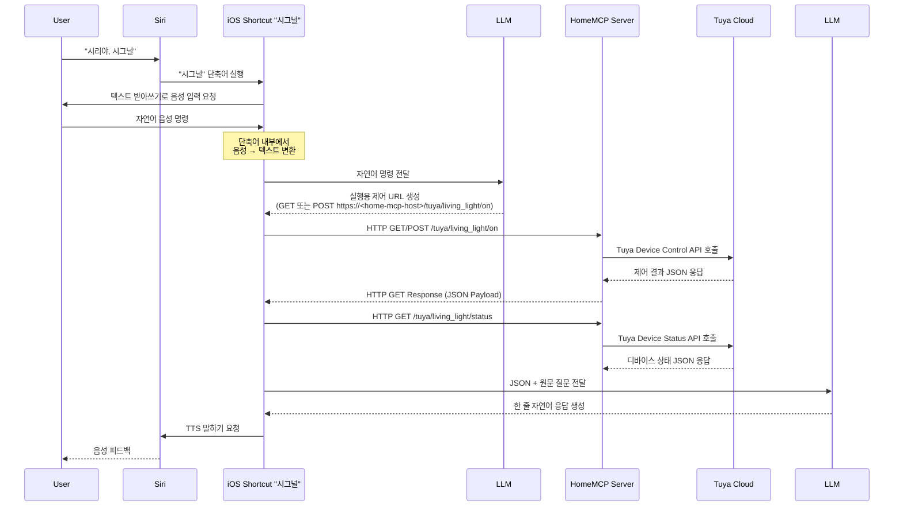

# HomeMCP

> **AI를 운영하지 않아도 되는, iOS 단축어 기반 스마트홈 오케스트레이터**
> 
> *“복잡한 로컬 LLM/GPU 세팅 없이, 아이폰 하나로 자연어 음성 스마트홈을 시작하세요.”*

[](https://opensource.org/licenses/MIT)
[](https://www.python.org/downloads/)
[](https://support.apple.com/ko-kr/guide/shortcuts/welcome/ios)


HomeMCP는 **iOS 단축어(Shortcuts)** 에서 바로 쓸 수 있는 **음성 기반 스마트홈 오케스트레이터**입니다.
사용자가 별도의 AI(로컬 LLM/유료 모델 서버 등)를 직접 운영하지 않아도, **단축어에서 제공되는 Apple Intelligence(비공개 클라우드)** 와 **ChatGPT(계정 보유 시 선택)** 를 활용해
자연어 명령을 **안전한 실행 포맷으로 변환**하고, 실제 제어 결과를 **짧고 친절한 한 줄 피드백**으로 돌려줍니다.

또한 자연어 음성 명령을 **표준 URL 스펙**(`/tuya/{device}/{action}`)으로 변환해, **브라우저/스크립트/자동화 어디서든 같은 방식으로 실행**할 수 있게 설계했습니다.

**TL;DR**
- 📱 **iOS 단축어에서 바로 사용**: 별도 앱/모델 서버 없이 “시리야, 시그널”로 시작
- 🤖 **AI 운영 불필요**: 로컬 LLM·GPU 없이 **단축어의 Apple AI(비공개 클라우드)** / **ChatGPT(선택)** 로 처리
- 🎙️ *말로 하면* → **LLM #1**이 실행 URL 생성 → HomeMCP가 실제 디바이스 제어
- 🔁 제어 결과(JSON) → **LLM #2**가 한 줄 응답 생성 → Siri가 TTS로 읽어줌
- 🧩 Tuya-first지만, Windows Agent 등 **외부 제어 대상 확장(Action 매핑)** 을 전제로 설계

## ✨ 왜 HomeMCP인가요?

- **🚫 AI 운영 부담 Zero**: 비싼 GPU도, 복잡한 로컬 LLM 세팅도 필요 없습니다. 단축어의 **Apple Intelligence(비공개 클라우드)** 와 **ChatGPT(선택)** 를 그대로 활용합니다.
- **🗣️ 진정한 자연어 제어**: “거실 불 켜줘” 같은 고정 커맨드가 아니라, “영화 보기 좋게 세팅해줘” 같은 표현도 **의도 기반으로 해석**합니다.
- **🔗 URL-First**: 모든 제어는 표준화된 URL 스펙(`/tuya/{device}/{action}`)으로 동작합니다. 음성뿐 아니라 스크립트/자동화/대시보드에서도 같은 방식으로 호출하세요.
- **🛠️ 확장에 열려있는 구조**: Tuya를 시작으로 Windows Agent, Matter, Zigbee 등 다양한 환경을 하나의 인터페이스로 통합하는 것을 지향합니다.

## 🤔 왜 이름이 HomeMCP인가요?

HomeMCP의 **MCP는 ‘Model Context Protocol’을 당장 전제로 한다는 의미가 아닙니다.**  
이 프로젝트에서 MCP는 집(Home)의 다양한 제어 채널을 하나로 묶는 **Control Plane(오케스트레이션 레이어)** 을 뜻합니다.

- 현재 HomeMCP는 **iOS 단축어 기반(iPhone-first)** 으로 설계되어, *별도의 AI 서버를 운영하지 않아도* 음성 기반 스마트홈 제어가 가능하도록 구현되어 있습니다.
- 동시에 내부 구조는 **Android 등 타 모바일 플랫폼**, **웹 클라이언트**, 그리고 **표준 MCP(Model Context Protocol) 인터페이스**까지 확장할 수 있도록 열어두었습니다.
- 즉, 지금의 핵심 가치는 **“No AI Hosting Required + iOS-native UX”** 이며,
  프로젝트 이름은 장기적으로 지향하는 **“확장 가능한 Home Control Plane”** 을 반영합니다.

> 정리하면, HomeMCP는 *지금은 가볍게 시작할 수 있는 iOS 중심 스마트홈 오케스트레이터*이면서,  
> *미래에는 다양한 클라이언트와 표준 프로토콜을 수용할 수 있는 구조*를 목표로 합니다.

---

## Demo

> (추가 예정) 20초 GIF/영상: “시리야, 시그널” → “영화 보기 좋게 세팅해줘” → 조명/기기 제어 + 음성 피드백

- 예시 호출
  ```bash
  # 조명 ON
  curl -X POST "http://localhost:8000/tuya/living_light/on"

  # 상태 조회
  curl -X GET "http://localhost:8000/tuya/living_light/status"

  # 시퀀스
  curl -X GET "http://localhost:8000/tuya/sequence?actions=living_light:on,subdesk_light:off%3Fdelay%3D5"
  ```

---

## Key Features

- 📱 **iOS Shortcuts 중심 UX**: “앱 설치/대시보드”보다 **단축어 실행**을 배포·사용 단위로 설계
- 🤖 **AI 운영 불필요 (No AI Hosting Required)**
  - 로컬 LLM, 별도 모델 서버, GPU/VRAM 없이 사용
  - **단축어의 Apple AI(비공개 클라우드)** + **ChatGPT(계정 보유 시 선택)** 조합 지원
- 🧠 **2단계 LLM 파이프라인(제품 기능)**
  - LLM #1: 자연어 명령 → **실행 URL 생성**(안전한 실행 포맷)
  - LLM #2: 제어 결과 JSON → **한 줄 피드백 생성**(실패 이유/상태 포함)
- 🔗 **URL 기반 제어 스펙**(GET/POST 공용): 음성/버튼/스크립트/스케줄러가 동일 실행 포맷 공유
- ☁️ **Tuya Cloud 실 디바이스 제어 연동** (on/off, brightness, status, scene, sequence)
- 🧩 **확장 가능한 Action 매핑 구조**: Tuya 외(Windows Agent 등) 제어 대상 확장 전제
- 🖥️ 기본 **Web Panel** 제공(디바이스/설정 확인 및 테스트)
- 🧰 **Monorepo 구성**: core 서버 / Shortcuts 배포 / (WIP) 프롬프트·스키마 오케스트레이션
- 🗺️ 통합 GUI 기반 디바이스·Scene·계정 관리 (계획)

---

## System Overview

AI Assistant(Siri) → iOS Shortcuts → LLM #1 → HomeMCP 서버 → (Tuya Cloud | Windows Agent) → 실제 디바이스  
실제 디바이스 → (Tuya Cloud | Windows Agent) → HomeMCP 서버 → LLM #2 → iOS Shortcuts → AI Assistant(Siri)

## Design Notes

HomeMCP는 “스마트홈을 붙여 쓰는” 프로젝트가 아니라, **의도 해석(LLM) ↔ 실행(HomeMCP) ↔ 피드백(LLM/TTS)** 을 분리해 조합 가능한 형태로 만드는 것을 목표로 합니다.

- **AI 운영 부담 제거**: 단축어에서 제공되는 Apple AI/ChatGPT를 활용해 *모델/서버 운영 없이* 음성 제어 경험 제공
- **벤더 종속 최소화**: 음성 플랫폼에 붙는 로직은 Shortcuts에, 실행 로직은 서버에 분리
- **자동화 친화적**: URL 스펙 하나로 음성/버튼/스크립트/스케줄러가 동일하게 동작
- **확장 가능**: Tuya-first지만, 이후 Matter/Zigbee/로컬 에이전트로 확장 가능한 구조

---

## Repository Structure

본 프로젝트는 단일 Monorepo 구조로 구성되며, 각 서브 디렉터리는 HomeMCP 시스템의 개별 구성 요소를 담당합니다.

```bash
HomeMCP/
  README.md                         # Project overview (EN)
  README.ko.md                      # Project overview (KO)

  home-mcp-core/                    # Central MCP server (FastAPI)
    src/                            # Server implementation
    cli/                            # CLI for setup / operations
    pyproject.toml
    web/                            # Web panel (templates/static)

  home-mcp-siri-shortcuts-signal/   # Siri Shortcut (Signal) distribution & docs
    README.md
    README.ko.md
    install/                        # iCloud link + setup checklist (KO/EN)
    prompts/                        # Canonical prompts (LLM #1 / #2)
    shortcuts/                      # Signal.shortcut + example
    scripts/                        # Export / validation helpers

  home-mcp-llm-flows/               # Prompt orchestration (planned / WIP)
    # Schemas, generators, CLI/GUI (future)
```

---

## What is HomeMCP?

HomeMCP는 본 프로젝트 전체를 관통하는 **중앙 오케스트레이션 레이어**로,  
`home-mcp-core`, `home-mcp-siri-shortcuts-signal`, `home-mcp-llm-flows` 세 개의 주요 프로젝트를 유기적으로 연결합니다.

HomeMCP의 궁극적인 목표는 다음과 같습니다.

- 사용자는 단일 GUI 또는 CLI 환경에서
  - Tuya 계정 인증
  - 디바이스 자동 스캔 및 등록
  - 디바이스 별 호출 이름(alias) 지정
  - Scene(시나리오) 생성 및 관리
- 위 설정을 기반으로
  - `home-mcp-core` 서버 설정 파일 자동 생성
  - `home-mcp-llm-flows`에서 LLM 프롬프트 자동 생성
  - `home-mcp-siri-shortcuts-signal`에서 해당 프롬프트를 사용하는 단축어 링크 자동 생성

즉, HomeMCP는 **사용자 설정 → 서버 설정 → LLM 프롬프트 → 음성 단축어까지를 하나의 파이프라인으로 자동 구성하는 통합 오케스트레이션 시스템**을 지향합니다.

---

## End-to-End Control Flow


---

## Component Roles

| 구성 요소 | 역할 |
|-----------|------|
| User | 음성 명령 입력 |
| AI Assistant (Siri) | 음성 명령 트리거 |
| iOS Shortcuts | 음성 변환, LLM 호출, HTTP 요청, 음성 출력 |
| LLM #1 | 자연어 명령 → 제어 URL 생성 |
| HomeMCP 서버 | 개인 MCP 서버, Tuya API 중계 |
| Tuya Cloud | 실제 IoT 디바이스 제어 |
| LLM #2 | JSON → 자연어 응답 생성 |

---

## Supported Capabilities

- 디바이스 ON / OFF  
- 조명 밝기(brightness) 조절  
- 디바이스 상태 조회  
- 프리셋(Scene) 실행  
  - 무드 조명 모드  
  - 영화 감상 모드  
  - 취침 모드  
- Windows PC 제어 (화면 제어, 앱 실행 등 – Agent 기반)

## Control URL Specification (HomeMCP v1)

HomeMCP는 **URL 기반 제어 규칙**을 중심으로 음성 명령, LLM, 자동화를 연결합니다.
모든 제어는 HTTP **GET / POST** 요청으로 실행할 수 있으며,
이 URL 체계는 LLM #1이 자연어 명령을 실제 제어 요청으로 변환하는 기준 스펙으로 사용됩니다.

---

### 1) Single Action (단일 동작)

```
/tuya/{device}/{action}
```

Optional delay:

```
/tuya/{device}/{action}?delay={seconds}
```

Examples:
- 거실 불 켜기  
  `/tuya/living_light/on`
- 책상 불 10초 뒤 끄기  
  `/tuya/subdesk_light/off?delay=10`
- 디바이스 상태 조회  
  `/tuya/living_light/status`

---

### 2) Sequence (복수 동작 / 시퀀스)

여러 개의 동작을 하나의 요청으로 실행할 수 있습니다.

```
/tuya/sequence?actions=step1,step2,...
```

각 step 형식:

```
{device}:{action}[?delay=seconds]
```

- `delay`는 선택 사항이며, **현재 시점 기준 지연 실행**을 의미합니다.
- delay가 없는 step은 즉시 실행됩니다.
- step은 **URL에 작성된 순서를 그대로 유지하여 실행**됩니다.

Examples:

- 문 열고 거실 불 켜기
```
/tuya/sequence?actions=door:open,living_light:on
```

- 불을 켰다가 2시간 뒤 끄고, 컴퓨터는 1시간 뒤 끄기
```
/tuya/sequence?actions=living_light:on,living_light:off?delay=7200,pc:off?delay=3600
```

이 URL 구조는 음성 명령, 자동화 루틴, LLM 기반 해석 결과를
**하나의 공통 실행 포맷**으로 통합하기 위한 HomeMCP의 핵심 설계입니다.

---

## Planned Extensions

- 일정 · 날씨 · 위치 · 센서 조건 기반 자동화
- **멀티 IoT 플랫폼 지원**
  - Tuya 외 Cloud API 제공 IoT 플랫폼 연동
  - 벤더 종속성을 제거한 공통 Action 레이어
- **로컬 통신 기반 디바이스 제어** (Zigbee / Matter 등)
- Windows / macOS 에이전트 기반 로컬 시스템 제어
- 카메라 및 각종 센서 연동
- HomeKit 포함 다중 플랫폼 하이브리드 제어
- 모바일 웹 대시보드 및 통합 Web GUI
- Google Assistant 등 타 음성 플랫폼 확장
- (추후) **표준 MCP 프로토콜 인터페이스** 제공 옵션 (외부 Tool Host 연동)

---

## System Automation Vision

HomeMCP는 단순한 서버 + 단축어 조합이 아니라,  
**사용자 설정을 중심으로 모든 구성 요소가 자동으로 생성·연동되는 시스템**을 목표로 합니다.

최종 목표 흐름은 다음과 같습니다.

1. 사용자가 HomeMCP GUI 또는 CLI에서 Tuya 계정을 연동
2. 디바이스 자동 스캔 및 등록
3. 각 디바이스 별 호출 이름(alias) 지정
4. 사용자 정의 Scene 생성
5. 위 설정을 기반으로
   - HomeMCP Core 설정 파일 자동 생성
   - LLM Control / Response 프롬프트 자동 생성
   - Siri Shortcut 링크 자동 생성

결과적으로 사용자는 **별도의 복잡한 설정 없이 음성 기반 스마트홈 제어 환경을 구성할 수 있는 구조**를 지향합니다.

---

## Project Objectives

본 프로젝트는 단순한 스마트홈 자동화 구현이 아니라,

- 음성 기반 AI 어시스턴트 중심의 IoT 제어 인프라 구조 설계
- 개인 서버 기반 **Home Control Plane** 구축 (실행 레이어/피드백 레이어 분리)
- LLM 기반 자연어 제어 및 응답 파이프라인 검증
- 특정 벤더에 종속되지 않는 확장형 음성 인터페이스 구조 실험

---

## Quick Start (초기 사용 방법)

> 아래 가이드는 **개발/테스트용 최소 셋업** 기준입니다. (배포/운영은 `Planned Extensions`의 Web GUI, 인증, 네트워크 보안 항목과 함께 별도 정리 예정)

### 2분 체험 (최소 동작 확인)

이미 Tuya Cloud 계정/디바이스가 준비되어 있다면, 아래 순서로 “일단 한 번” 동작을 확인할 수 있습니다.

1) `settings.toml`에 Tuya Cloud 계정/리전(endpoint) 입력
2) `devices.toml`에 최소 1개 디바이스 등록(별칭 포함)
3) 서버 실행 후 `curl`로 on/status 호출

> Siri/Shortcuts 연동은 그 다음 단계입니다.

### 0) 권장 환경

- **Python 3.11+ 권장** (표준 라이브러리 `tomllib` 사용)
  - 로컬 개발은 **3.12**를 권장합니다.
- macOS / Linux 권장

### 1) 레포 클론

```bash
git clone https://github.com/jaebinsim/HomeMCP
cd home-mcp
```

### 2) Python 가상환경 만들기

```bash
python3 -m venv .venv
source .venv/bin/activate
python -m pip install -U pip
```

### 3) 의존성 설치

HomeMCP는 Monorepo 구조이지만,  
**현재 Python 의존성은 `home-mcp-core/pyproject.toml`에서 단일 관리**됩니다.

초기 실행을 위해서는 `home-mcp-core`만 설치하면 됩니다.

```bash
cd home-mcp-core
pip install -e .
```

### 4) Tuya 연동 설정 (TOML)

디바이스 정의/계정 정보를 **TOML 설정 파일**로 관리합니다.

1) 예시 템플릿을 복사해서 내 설정 파일을 만듭니다.

```bash
cp home-mcp-core/config/settings.example.toml home-mcp-core/config/settings.toml
cp home-mcp-core/config/devices.example.toml home-mcp-core/config/devices.toml
```

### 5) 서버 실행 (home-mcp-core)

```bash
cd home-mcp-core
python -m uvicorn home_mcp_core.app:app --host 0.0.0.0 --port 8000 --reload
```

- `http://127.0.0.1:8000/panel/`
  - 기본 관리 페이지(Web Panel)입니다. 디바이스/설정 확인 및 테스트에 사용합니다.

#### 관리 페이지 미리보기 (Web Panel)

아래는 HomeMCP Core 서버에 포함된 기본 웹 관리 페이지 예시입니다.  
디바이스 등록 상태, 설정 파일 미리보기, 그리고 간단한 디버깅을 위해 사용됩니다.

**Overview (Dashboard)**


**Devices Management**


### 6) 기본 제어 테스트

```bash
# 단일 동작: 조명 ON
curl -X POST "http://localhost:8000/tuya/living_light/on"

# 단일 동작: 조명 OFF
curl -X POST "http://localhost:8000/tuya/living_light/off"

# 상태 조회
curl -X GET "http://localhost:8000/tuya/living_light/status"

# 시퀀스: 거실 불 켜고 5초 뒤 책상 불 끄기
curl -X GET "http://localhost:8000/tuya/sequence?actions=living_light:on,subdesk_light:off?delay=5"
```

### 7) Siri Shortcuts 연결 (home-mcp-siri-shortcuts-signal)

1) `home-mcp-siri-shortcuts-signal/install/setup-checklist.ko.md`를 따라 단축어를 설치
2) 단축어 내부의 HomeMCP 서버 주소를 내 서버 주소로 변경
3) 음성으로 호출

- “시리야, 시그널” → 받아쓰기 → “거실 불 켜줘”

> ⚠️ 현재 LLM 프롬프트/플로우 자동 생성 기능은 구조 설계 단계이며,
> 초기 버전에서는 개념 설명 위주로 제공됩니다. (CLI/GUI 기반 자동화는 추후 제공 예정)

### 8) LLM 프롬프트/플로우 설정 (home-mcp-llm-flows)

`home-mcp-llm-flows`는
- LLM #1: 자연어 → 실행 URL 생성
- LLM #2: JSON 결과 → 자연어 응답

을 위한 프롬프트/스키마를 관리합니다.

---

## Troubleshooting

- **Tuya 제어가 안 먹는 경우**
  - endpoint(리전) 확인, device_id 확인, 디바이스 capability 확인(밝기 지원 여부 등)
- **서버는 뜨는데 단축어에서 실패하는 경우**
  - iOS에서 로컬 네트워크 접근 권한/방화벽/포트포워딩/SSL 확인

---

## 📱 Siri Shortcuts (Signal) 문서 바로가기

HomeMCP의 음성 제어 진입점인 **Siri Shortcuts (Signal)** 과 관련된 문서들입니다.  
실제 음성 제어를 사용하려면 아래 문서들을 순서대로 참고하는 것을 권장합니다.

- 📄 **Signal 단축어 프로젝트 개요**
  - [home-mcp-siri-shortcuts-signal/README.ko.md](home-mcp-siri-shortcuts-signal/README.ko.md)

- 🔗 **iCloud 단축어 설치 링크**
  - [home-mcp-siri-shortcuts-signal/install/iCloud-link.ko.md](home-mcp-siri-shortcuts-signal/install/iCloud-link.ko.md)

- ✅ **단축어 설정 체크리스트 (필수)**
  - [home-mcp-siri-shortcuts-signal/install/setup-checklist.ko.md](home-mcp-siri-shortcuts-signal/install/setup-checklist.ko.md)

- 🧠 **LLM 프롬프트 가이드**
  - [home-mcp-siri-shortcuts-signal/prompts/README.ko.md](home-mcp-siri-shortcuts-signal/prompts/README.ko.md)

---