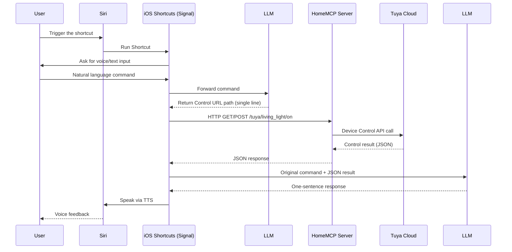

🇰🇷 [한국어 README 보기](README.ko.md)

# HomeMCP

> **A smart-home orchestrator powered by iOS Shortcuts — a zero‑infrastructure AI experience**
>
> *“No local LLM, no GPU setup — start natural-language voice control with just an iPhone + Shortcuts.”*

[](https://opensource.org/licenses/MIT)
[](https://www.python.org/downloads/)
[](https://support.apple.com/guide/shortcuts/welcome/ios)

HomeMCP is a **voice-first smart home orchestration system** integrated with **iOS Shortcuts**.
You don’t need to host your own AI (local LLM / paid model server). Instead, HomeMCP leverages **Apple Intelligence features available inside Shortcuts (private cloud)** and **ChatGPT (optional, if you have an account)** to:

- turn natural language into a **safe, executable control request** (LLM #1)
- return a **short, friendly one-line voice feedback** from the actual device result (LLM #2)

It also standardizes execution using a **Control URL spec** (`/tuya/{device}/{action}`), so the same actions can be triggered from voice, scripts, automation, or dashboards.

**TL;DR**
- 📱 **Shortcuts-first UX**: start with “Hey Siri” + a Shortcut — no extra app required
- 🤖 **No AI hosting required**: use Shortcuts’ Apple Intelligence (private cloud) / ChatGPT (optional)
- 🎙️ Speak → **LLM #1** generates a Control URL → HomeMCP executes on real devices
- 🔁 Result JSON → **LLM #2** produces a one-line response → Siri reads it via TTS
- 🧩 Tuya-first, designed to extend to external controllers (e.g., Windows Agent)

## ✨ Why HomeMCP?

- **🚫 Zero AI ops**: no GPU, no local LLM hosting — reuse the AI already available in Shortcuts (and ChatGPT optionally).
- **🧠 Runs on ultra-low-spec hardware**: HomeMCP Core does not assume a powerful machine.
  - no dedicated LLM server, no GPU, no high-memory environment required
  - proven to run in real-world daily use on a **Raspberry Pi Zero 2W**
- **🗣️ Real intent-based control**: not just fixed commands like “turn on the light,” but “set things up for movie night.”
- **🔗 URL-First**: one standardized URL format for voice, scripts, automation, and dashboards.
- **🛠️ Built to extend**: start with Tuya, grow toward Windows Agent, Matter, Zigbee, and more.

## 🚀 The Vision: Home Master Control Plane

HomeMCP is not just a bridge. It aims to become a **central Control Plane** that unifies home devices/states/scenes into
**LLM-readable context**, and evolves into a **Home-to-LLM Protocol**.

Today, HomeMCP delivers a lightweight, practical “MCP” via iOS Shortcuts.
Long-term, it plans to offer an (optional) **standard MCP (Model Context Protocol) interface** for integration with external Tool Hosts/clients.

---

## Demo

Below are short real-world demos showing **natural language voice commands**
executed through iOS Shortcuts → HomeMCP → real devices.

### 🎥 Demo 1 — “Make the house feel cozy”

**GIF (quick preview)** 

**Video (full clip)** <video src="docs/videos/demo-make-the-house-feel-cozy.mp4" controls width="100%"></video>

---

### 🎥 Demo 2 — “I'm going to sleep”

**Video (full clip)** <video src="docs/videos/demo-im-going-to-sleep.mp4" controls width="100%"></video>

---

- Example calls
  ```bash
  # Light ON
  curl -X POST "http://localhost:8000/tuya/living_light/on"

  # Status query
  curl -X GET "http://localhost:8000/tuya/living_light/status"

  # Sequence (URL-encoded step delay)
  curl -X GET "http://localhost:8000/tuya/sequence?actions=living_light:on,subdesk_light:off%3Fdelay%3D5"
  ```

## ⚡ 2-minute Quick Start

Verify the core loop in three steps:

1) Run `homemcp init` to generate your Tuya + device configuration
2) Run the server
3) Test with `curl` (on/status) or the Web Panel

👉 See the full guide in **[Quick Start](#quick-start-development--local)** below.

---

## Key Features

- 📱 **iOS Shortcuts-first UX**: Shortcuts are the distribution + usage unit (not an extra app/dashboard)
- 🤖 **No AI Hosting Required**
  - no local LLM, no dedicated model server, no GPU/VRAM
  - supports **Apple Intelligence inside Shortcuts (private cloud)** + **ChatGPT (optional)**
- 🧠 **Lightweight Core Server**
  - HomeMCP Core focuses on orchestration (HTTP control + device gateway)
  - designed to run 24/7 on low-power home servers (e.g., Raspberry Pi / mini PC)
- 🧠 **Two-stage LLM pipeline (as a product feature)**
  - **LLM #1**: natural language → **Control URL** (safe execution format)
  - **LLM #2**: result JSON → **one-line feedback** (includes failure reasons/status)
- 🔗 **Unified Control URL spec** (GET/POST): one format shared by voice/buttons/scripts/schedulers
- ☁️ **Real Tuya Cloud device control** (on/off, brightness, status, scenes, sequences)
- 🧩 **Extensible action mapping**: designed to expand beyond Tuya (e.g., Windows Agent)
- 🖥️ Built-in **Web Panel** for configuration checks and quick tests
- 🧰 **Monorepo**: core server / Shortcuts distribution / (WIP) prompt & schema orchestration
- 🗺️ Unified GUI for device/scene/account management (planned)

---

## System Overview

AI Assistant (Siri) → iOS Shortcuts → LLM #1 → HomeMCP Server → (Tuya Cloud | Windows Agent) → Physical Devices  
Physical Devices → (Tuya Cloud | Windows Agent) → HomeMCP Server → LLM #2 → iOS Shortcuts → AI Assistant (Siri)

---

## Repository Structure

This project is a **monorepo**, where each subdirectory represents a core component of the HomeMCP pipeline.

```bash
HomeMCP/
  README.md                         # Project overview (EN)
  README.ko.md                      # Project overview (KO)

  home-mcp-core/                    # Central MCP server (FastAPI)
    src/                            # Server implementation
    cli/                            # CLI for setup / operations
    pyproject.toml
    web/                            # Web panel (templates/static)

  home-mcp-siri-shortcuts-signal/   # Siri Shortcut (Signal) distribution & docs
    README.md
    README.ko.md
    install/                        # iCloud link + setup checklist (KO/EN)
    prompts/                        # Canonical prompts (LLM #1 / #2)
    shortcuts/                      # Signal.shortcut + example
    scripts/                        # Export / validation helpers

  home-mcp-llm-flows/               # Prompt orchestration (planned / WIP)
    # Schemas, generators, CLI/GUI (future)
```

---

## What is HomeMCP?

HomeMCP is **Shortcuts-first today** (so you can start without running your own AI),
but long-term it aims to become an **integrated Home Control Plane** that automatically connects
accounts/devices/scenes/prompts and voice shortcut distribution from a single configuration.

Below is the “ultimate integration scenario” HomeMCP is aiming for.

### Ultimate Vision

From a single GUI or CLI, users will be able to:

- Authenticate IoT accounts (Tuya and more)
- Auto-discover and register devices
- Assign human-friendly aliases
- Define custom Scenes

Based on this configuration, HomeMCP automatically generates:

- `home-mcp-core` server configuration
- LLM control & response prompts
- Siri Shortcut distribution links

In other words, HomeMCP aims to become:

> **A unified orchestration system that turns user configuration into server logic, LLM behavior, and voice shortcuts automatically.**

---

## End-to-End Control Flow



---

## Component Roles

| Component | Role |
|----------|------|
| User | Issues voice commands |
| AI Assistant (Siri) | Voice trigger |
| iOS Shortcuts | Speech-to-text, LLM calls, HTTP execution, TTS output |
| LLM #1 | Natural language → control URL path |
| HomeMCP Server | Personal MCP server + IoT gateway |
| Tuya Cloud | Real-world IoT device control |
| LLM #2 | Control JSON → natural language response |

---

## Supported Capabilities

- Device ON / OFF
- Light brightness control
- Device status queries
- Preset Scene execution
  - Mood lighting
  - Movie mode
  - Sleep mode
- Windows PC control (screen, application launch – agent-based)

---

<details>
<summary><b>Control URL Specification (API)</b> — expanded spec (click to open)</summary>

## Control URL Specification (HomeMCP v1)

HomeMCP uses a **URL-based control scheme** that unifies voice commands, LLM output, and automation routines.  
All controls can be executed via HTTP **GET / POST**, and this specification is the contract used by **LLM #1**.

### 1) Single Action

```text
/tuya/{device}/{action}
```

Optional delay:

```text
/tuya/{device}/{action}?delay={seconds}
```

Examples:

- Turn on living room light  
  `/tuya/living_light/on`
- Turn off desk light after 10 seconds  
  `/tuya/subdesk_light/off?delay=10`
- Query device status  
  `/tuya/living_light/status`

### 2) Sequence (Multiple Actions)

Run multiple actions in a single request:

```text
/tuya/sequence?actions=step1,step2,...
```

Step format:

```text
{device}:{action}[?delay=seconds]
```

- `delay` is optional and represents a **relative delay from “now”**.
- Steps without `delay` run immediately.
- Steps execute **in the order they appear**.

Examples:

- Open door, then turn on living room light
```text
/tuya/sequence?actions=door:open,living_light:on
```

- Turn on light, turn it off after 2 hours, and turn off PC after 1 hour
```text
/tuya/sequence?actions=living_light:on,living_light:off?delay=7200,pc:off?delay=3600
```

This URL scheme is a core design of HomeMCP to standardize execution across voice, LLM, and automation.

---
 </details>


## Planned Extensions

- Schedule / weather / location / sensor-driven automation
- A home-server operation guide for low-power always-on setups (Raspberry Pi, mini PC, etc.)
- **Multi IoT platform support**
  - Integrate other IoT platforms that provide Cloud APIs (beyond Tuya)
  - Vendor-agnostic common Action layer
- **Local protocol device control** (Zigbee / Matter, etc.)
- Windows / macOS agent-based local system control
- Camera and security sensor integration
- Hybrid control across multiple platforms (including HomeKit)
- Mobile web dashboard + unified Web GUI
- Google Assistant and other voice platforms

---

## Quick Start (Development / Local)

> This is a minimal setup for development/testing. Production hardening (auth, SSL, network security) will be documented separately.

### 0) Recommended Environment

- **Python 3.11+**
  - **3.12** is recommended for local development
- macOS / Linux recommended

### 1) Clone

```bash
git clone https://github.com/jaebinsim/HomeMCP
cd HomeMCP
```

### 2) (Optional) Install / pin Python with pyenv (macOS)

```bash
brew update
brew install pyenv

pyenv install 3.12.2
pyenv local 3.12.2
```

> If you already have Python 3.11+ available, you can skip this.

### 3) Create a virtual environment

```bash
python3 -m venv .venv
source .venv/bin/activate

python -m pip install --upgrade pip
```

### 4) Install `home-mcp-core`

HomeMCP is a monorepo, but **Python dependencies are currently managed in `home-mcp-core/pyproject.toml`**.  
For the initial run, installing `home-mcp-core` is enough.

```bash
python -m pip install -e ./home-mcp-core
```

### 5) Configure via Wizard (no manual TOML editing)

You no longer need to copy/edit TOML files by hand.
`homemcp init` guides you through required settings (account/region/devices) and generates config files automatically.

```bash
homemcp --help
homemcp init
```

- Generated config files:
  - `home-mcp-core/config/settings.toml`
  - `home-mcp-core/config/devices.toml`

### 6) Run the server

```bash
uvicorn home_mcp_core.app:app --host 0.0.0.0 --port 8000 --reload
```

- Web Panel
  - Local: `http://127.0.0.1:8000/panel/`
  - Same Wi‑Fi/LAN: `http://<your-local-ip>:8000/panel/`

### 7) Device management CLI

```bash
homemcp devices --help
```

### 8) Basic control tests (optional)

```bash
# Single action: Light ON
curl -X POST "http://localhost:8000/tuya/living_light/on"

# Single action: Light OFF
curl -X POST "http://localhost:8000/tuya/living_light/off"

# Status query
curl -X GET "http://localhost:8000/tuya/living_light/status"

# Sequence: turn on living light, then turn off desk light after 5 seconds
curl -X GET "http://localhost:8000/tuya/sequence?actions=living_light:on,subdesk_light:off?delay=5"
```

### 9) Connect Siri Shortcuts

Follow the setup guide:

- `home-mcp-siri-shortcuts-signal/install/setup-checklist.md` (EN) / `home-mcp-siri-shortcuts-signal/install/setup-checklist.ko.md` (KO)

> ⚠️ Prompt/flow auto-generation is still in the design stage.
> For now, documentation focuses on the concept and how Shortcuts uses the prompts.

---

## Troubleshooting

- **Tuya control not working**
  - Verify endpoint (region), device IDs, and device capabilities (e.g., brightness support).
- **Server works but iOS Shortcut fails**
  - Check local network permissions, firewall/port-forwarding, and SSL configuration.

---

## 📱 Siri Shortcuts (Signal) – Related Documentation

The documents below explain how these prompts are actually used inside the
**HomeMCP Signal iOS Shortcut**, from installation to full configuration.

If you are setting up voice control for the first time, it is recommended
to read them in order.

- 📄 **Signal Shortcut Overview**
  - [home-mcp-siri-shortcuts-signal/README.md](home-mcp-siri-shortcuts-signal/README.md)

- 🔗 **Install Signal Shortcut (iCloud Link)**
  - [home-mcp-siri-shortcuts-signal/install/iCloud-link.md](home-mcp-siri-shortcuts-signal/install/iCloud-link.md)

- ✅ **Signal Setup Checklist**
  - [home-mcp-siri-shortcuts-signal/install/setup-checklist.md](home-mcp-siri-shortcuts-signal/install/setup-checklist.md)

- 🧠 **LLM Prompt Usage Guide**
  - [home-mcp-siri-shortcuts-signal/prompts/README.md](home-mcp-siri-shortcuts-signal/prompts/README.md)

---